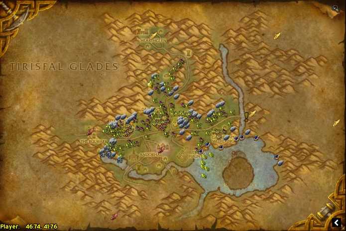
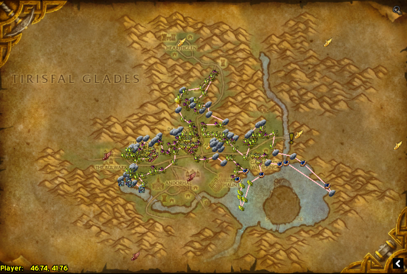
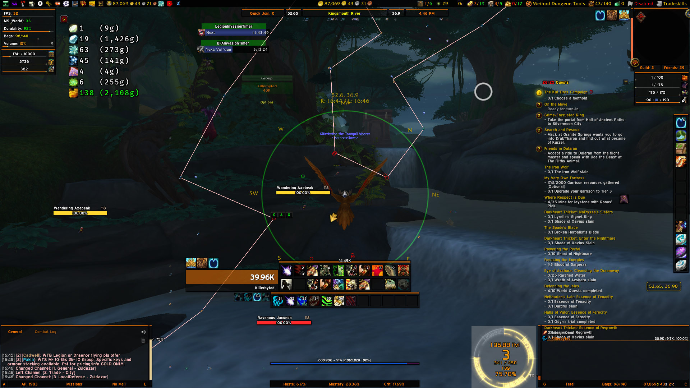

In my brief career as a WoW goldmaker, I've managed to accrew a toolset of various addons that I use regularly enough for goldmaking. Listed below are these very addons and why they are important for any goldmaker.

###Basic Goldmaking Addons

**TradeSkillMaster**
In general, I tend to use [TradeSkillMaster](https://www.tradeskillmaster.com) or TSM because it is arguably the best goldmaking toolkit out there for goldmakers. There are plenty of guides out there on how to use TSM from [HazelNuttyGames](https://www.youtube.com/playlist?list=PLHBcemKOV_HZIeh3g4E_S_2hdq14YGzF9) to [SamadanPlaysWoW](https://www.youtube.com/playlist?list=PLG8qo-Ls_-9Yy_gM2j5ASyDBBnIVregnP) or even right [here](/tsm-guide-part-1). I tend to use TSM groups from both [Sheyrah](https://pastebin.com/u/Sheyrah) and [Torack](https://pastebin.com/u/Torack) which imports profession groups. You can read my guide starting [here](./tsm-guide-part-1)

**Accountant Classic**
I personally like to keep a ledger of sorts for my goldmaking to see how much gold is coming out, how much is coming in, etc... Accountant Classic provides that functionality for me, logging everything on a per-session basis. Previously, I had to write an entire spreadsheet with many macros to achieve the same functionality. To download, visit [here](https://www.curseforge.com/wow/addons/accountant-classic).

**The Undermine Journal - Website and Addon**
The Undermine Journal is a fantastic resource for goldmakers in general. The [website](http://www.underminejournal.com) is a goldmaker's best friend, constantly scanning the Auction House for up to date prices. Undermine Journal also keeps track of items that could be considered a great deal to invest in. The addon however allows you to pull that same realm-specific pricing information and adds it to your tooltip in game. You can get the addon from [here](https://www.curseforge.com/wow/addons/undermine-journal).

###Addons for gathering professions
I have three main addons for gathering as well as creating routes based on the nodes that I find. 

**1. GatherMate 2**
GatherMate 2 marks the map with nodes from herbing and mining. 

**2. Routes**
Routes takes the data from GatherMate 2 and converts that into a route that can me followed on a minimap or through FarmHUD.

**3. FarmHUD**
FarmHUD takes the GatherMate2 and Routes overlay from the minimap and overlays it across your screen

###Specific Goldmaking Addons

These particular addons fill a particular niche in the goldmaking toolkit

**Scrap Master**
Scrap Master is made by the legendary goblin, BilisOnyxia. Most goldmakers have heard of him because of his TSM Sniper string. Scrap Master allows players to partially automate the process of scrapping items in Battle for Azeroth. With the click of a button, the scrapping queue can be filled with items and a click of that same button, starts scrapping the lot. With the ability to also add items to an ignore list as to not accidentally scrap a vital piece of gear. I'm likely to still be using this addon once we move on from Battle for Azeroth due a need to continue my BfA enchanting shuffle so I still have enchanting materials.

**LootAppraiser / LootAppraiser Challenge**
Now LootAppraiser is great addon particularly if you are farming content like old dungeons and raids and appraising non-soulbound items that drop off trash or even bosses. It's Challenger offshoot is especially good if you want to compete with friends or even a Twitch chat. It does work alongside price sources from TSM and other addons but overall, this is a great addon to have while farming content. I occassionally compete in said challenges with two streamers in particular [Persephonæ](https://www.twitch.tv/persephonae) and [Ellelaith](https://www.twitch.tv/ellelaith)