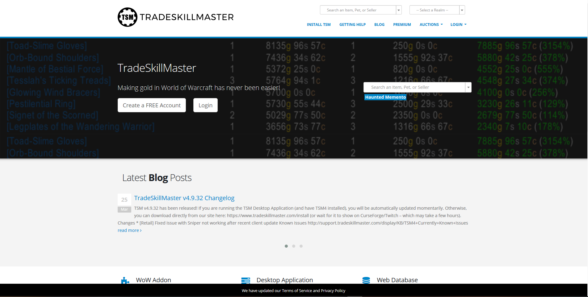
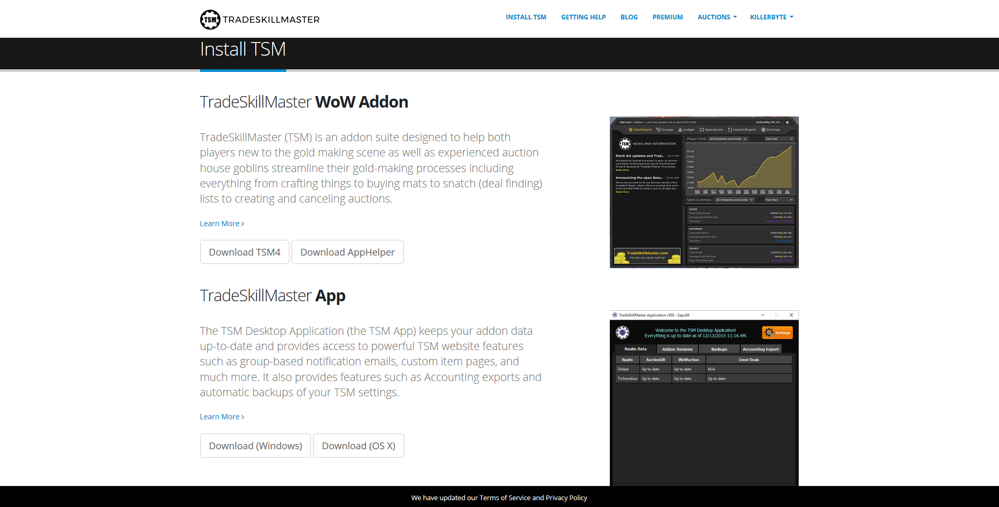
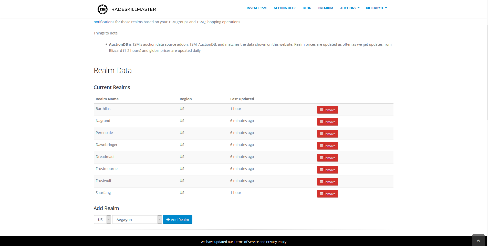
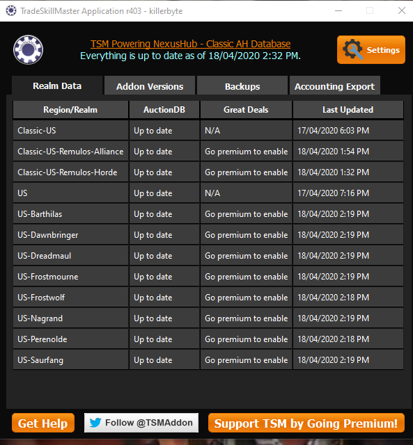
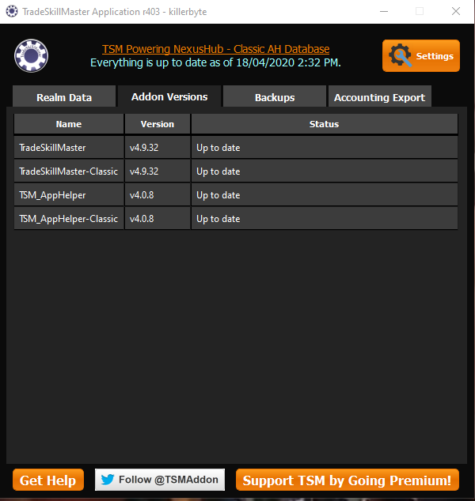

So, you want to start using TradeSkillMaster to make gold. TSM is a fantastic addon for assisting players in making gold. Such features include the ability to post mass auctions with a few clicks on the mouse and even helping users to craft items that are profitable. In this beginners guide, we will go through the following:
 - [Setting up a TSM Account and the TSM App](/tsm-guide-part-1)
 - [TSM Introduction and TSM Groups](/tsm-guide-part-2)
 - [TSM Operations and posting our first auctions](/tsm-guide-part-3)
 - TSM Sniper
 - Crafting items with TSM
 - TSM Mailing Operations
 - TSM Custom Prices
 - Warehousing Operations

 Here in Part 1, we will focus on setting up TSM for the first time. Now, to start with, you will need a TSM account so navigate to the [TradeSkillMaster](https://www.tradeskillmaster.com) website, hover over the Login button and then click on Create an Account.
 
 
 Once you are done creating your account, you will need to click on the Install TSM button on the TSM website. Now only install the TradeSkillMaster App. Do not install the Addon, we will do that later through the TSM App.
 

 Now that the TSM app is installed, we need to do one more thing in the TSM website to make everything work and that is configure the realms that we wish to pull data from. To do that, you need to hover over your name in the right hand corner of the website where Login used to be, then under App Configuration, click on Realm Selection. Now if you scroll down a little bit, you will come across a section called Add Realm. From there, select the region whether you are NA or EU and then select your realm. Then click on Add Realm to add your realm to the list of realms that TSM will pull auction data for.

 

Now we're done with the website. Now we need to open the TSM App and login. You should see something similar to down below except with your realm.

Now you need to click on Addon Versions and install TradeSkillMaster and TSM_AppHelper. This will immediately install the two addons necessary for TSM to function inside of World of Warcraft.

Now you are finished with the basic setup of TSM. In the next section, we will introduce you to TSM within World of Warcraft and start you off by creating groups.

In the next section, we will start creating a group for us to put some items in to sell.