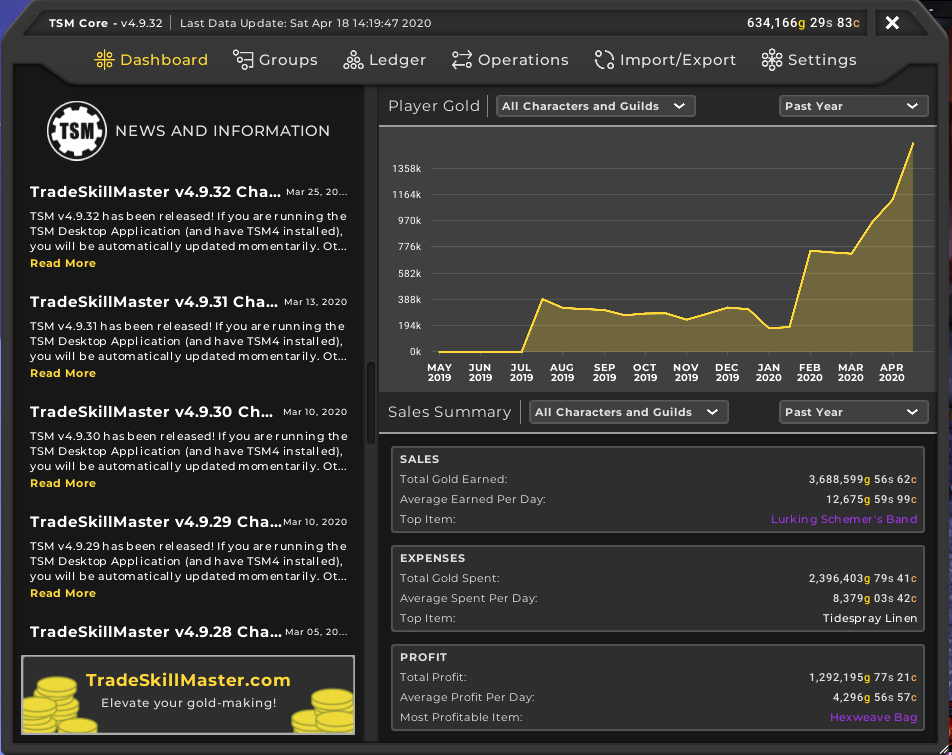
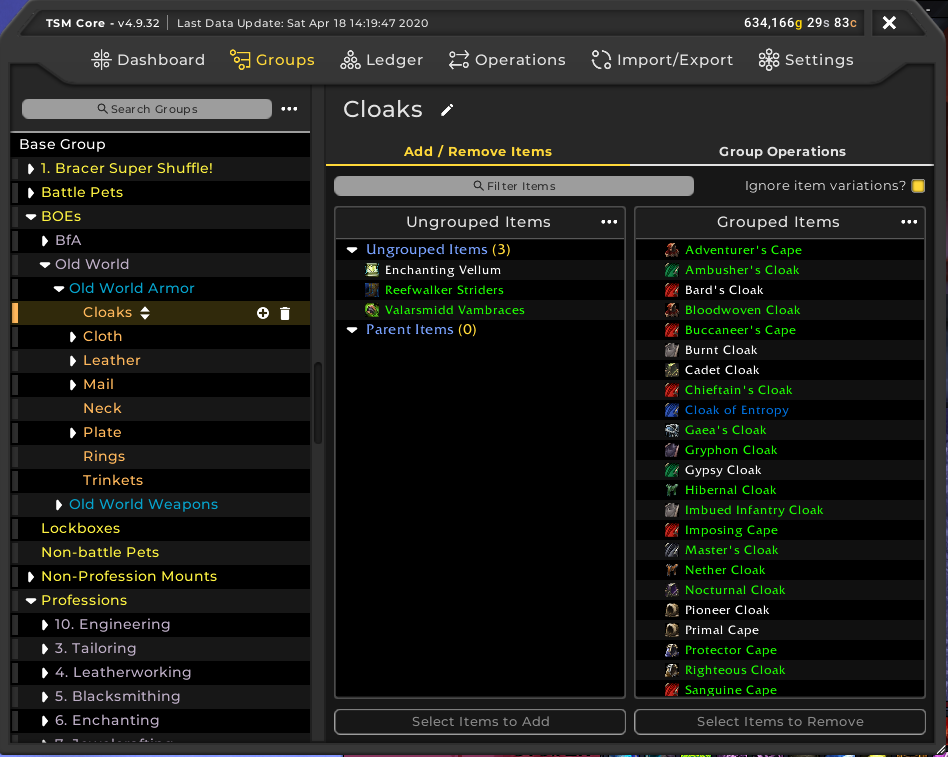
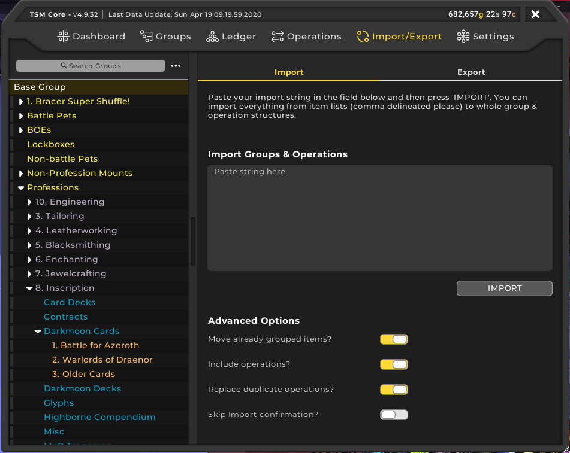

So, you want to start using TradeSkillMaster to make gold. TSM is a fantastic addon for assisting players in making gold. Such features include the ability to post mass auctions with a few clicks on the mouse and even helping users to craft items that are profitable. In this beginners guide, we will go through the following:
 - [Setting up a TSM Account and the TSM App](/tsm-guide-part-1)
 - [TSM Introduction and TSM Groups](/tsm-guide-part-2)
 - [TSM Operations and posting our first auctions](/tsm-guide-part-3)
 - [Crafting items with TSM](./tsm-guide-part-4)
 - [TSM Custom Prices](./tsm-guide-part-5)
 - TSM Mailing Operations
 - Warehousing Operations
 - TSM Sniper

Here in part 2, we will be introducing you to TradeSkillMaster inside World of Warcraft and creating our first group which will contain Bind of Equip items or BoEs. These particular items are easy enough to come across from questing to running dungeons and the occasional raid. Now these items can sell as there are people out there wanting transmog for their characters or people running the AllTheThings addon and they are collecting appearances.

To start with, if you click on the TSM icon in the minimap or which ever bars you use (I personally use Bazooka), you should be greeted with the following view.

So, here on the dashboard, you can see some statistics like how much gold I have made, how much gold I have spelt and what profit I have made. Personally, I don't pay attention to much to it but you can modify the data to look at all of your characters or a particular character.

Now we need to create our first group. So click on the Groups button and you should have a clean slate unlike myself.

If you hover over the Base Group in the left hand panel, a + symbol should appear. Click on that + symbol. On the right hand side, you can rename the group to BoEs. 

Now underneath, there are two parts, Ungrouped Items and Grouped Items. Grouped Items should be completely empty. To add items, simply select them in the Ungrouped Items section and then click Select Items to Add. To remove items, select them in the Grouped Items and then click Select Items to Remove. 

And there you go, you now have the ability to create TSM groups. You can create nested groups as well so like in my image, my BoE's are split into multiple categories.

At this point, I should point out that there are pre-made groups that other goldmakers have created. I mentioned in the [Recommended Addons](/recommended-addons) guide that I use both [Sheyrah](https://pastebin.com/u/Sheyrah) and [Torack](https://pastebin.com/u/Torack) which imports profession groups. To import these groups within WoW, after copying the group you want, you open the main TSM window and click on Import/Export. Paste the contents in the text area provided and click on Import. 

This will take a bit to process particularly for the larger groups. You will be sent to another window asking if you want to import the groups/operations. Click Confirm and then you have imported groups and some will have operations already attached.

In the next section, we will wrap up the auction part of the TSM guide by setting up our auction operation and then finally posting our auctions using TSM.