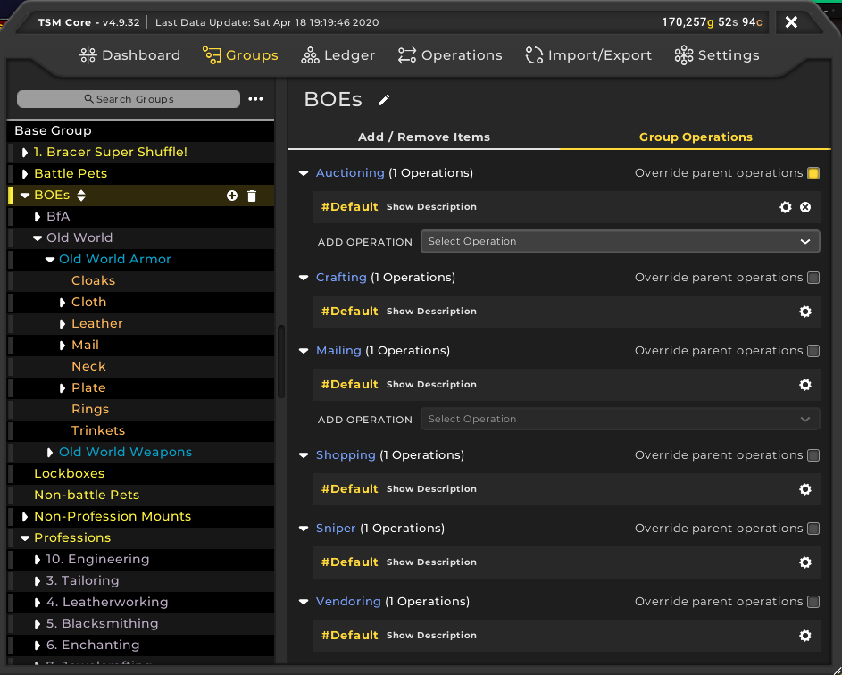
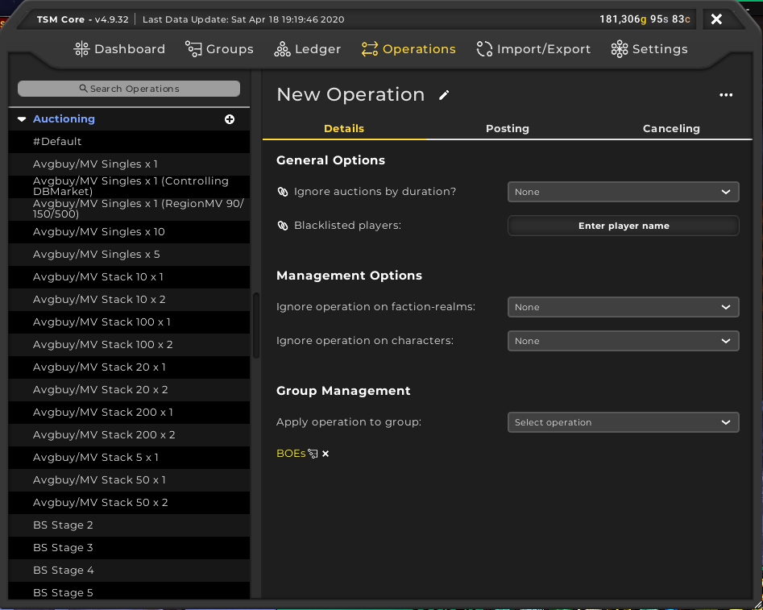
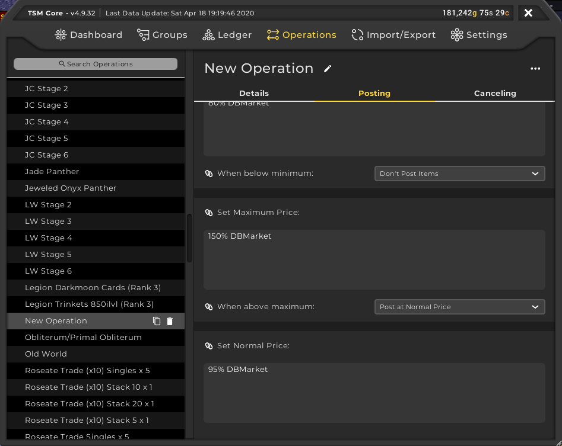
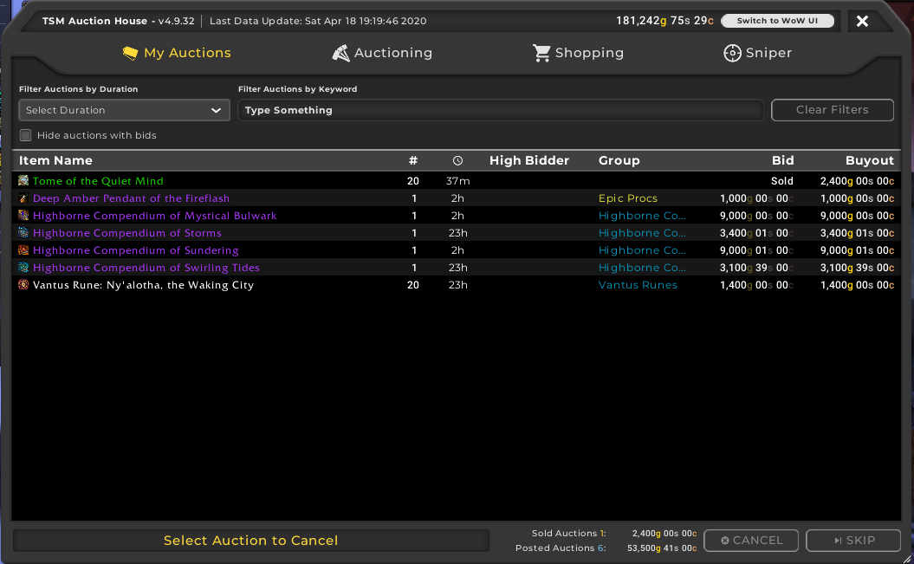
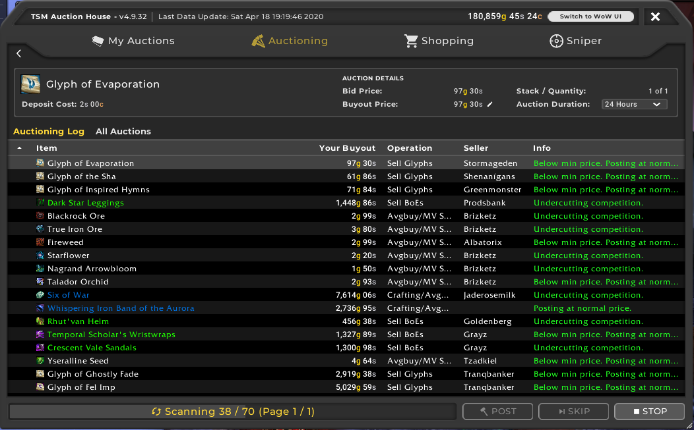

So, you want to start using TradeSkillMaster to make gold. TSM is a fantastic addon for assisting players in making gold. Such features include the ability to post mass auctions with a few clicks on the mouse and even helping users to craft items that are profitable. In this beginners guide, we will go through the following:
 - [Setting up a TSM Account and the TSM App](/tsm-guide-part-1)
 - [TSM Introduction and TSM Groups](/tsm-guide-part-2)
 - [TSM Operations and posting our first auctions](/tsm-guide-part-3)
 - [Crafting items with TSM](./tsm-guide-part-4)
 - TSM Custom Prices
 - TSM Mailing Operations
 - Warehousing Operations
 - TSM Sniper

 In this part, we're going to introduce you to TSM operations, create our first Auction operation and then post our BoE's onto the Auction House using TSM.

 Now there are 6 types of TSM operations
  - Auctioning
    - Can set a min, max and a normal price for groups using that operation
  - Crafting
    - Can queue items to craft.
  - Mailing
    - Can mail items to a particular character. e.g. Lockboxes to a Rogue character.
  - Shopping
    - Can search for cheap items from a particular group on the Auction House
  - Sniper
    - Helps to snag cheap items as they are posted onto the Auction House
  - Warehousing
    - Automate moving certain items between your bank and your inventory
  - Vendoring
    - Can automate buying items from a vendor i.e. Parchment for scribes.

Now we will touch on most of these operations as the guide goes along but for this part, we will only be focusing on the auctioning operation. Now we will revisit our BoE group and you should see an extra tab called Group Operations. Click on that and you should see something like this.

Now, under Auctioning, click on the Override parent operations option. Now we can modify the operations being used by this group. You can stack operations if need be but with the 8.3 patch, this has become largely unnecessary. Click on the Add Operation drop down box and select Create New Operation. You should see something similar to below.

We need to focus primarily on the Posting section of the operation. Because these are Bind of Equip items, we want them to be on the Auction House for a while so 24hrs shall suffice. We can keep the post cap to 5 for the moment so we can have 5 of the same item on the Auction House at any one time. We no longer need to worry about a undercut amount because of the Auction House changed introduced in Patch 8.3. 

Now we're at the important part, the minimum, maximum and normal prices. At this point, we need to introduce you to price sources. TSM has a bunch of prices sources such as the region market value and the historical price just to name a few. You can find them all [here](http://support.tradeskillmaster.com/display/KB/Custom+Prices). For this part, I'm actually going to cheat and borrow [The Gold Queen](http://www.thegoldqueen.com/warcraft-addons/vendor-disenchant-greens-part-2/)'s values for the sake of this guide. 

Minimum price: `80% DBMarket`\
Maximum price: `150% DBMarket`\
Normal price: `95% DBMarket`

**Note: I am aware that Gold Queen updated her prices but that is currently outside the scope of this guide. We will revisit this in the TSM Custom Prices guide.**

With operations, you can assign them to multiple groups if you want. A lot of the time, I have specialised operations for certain items like Leatherworking drums for instance. 

But with that out of the way, we've done everything we can to finally sell some stuff on the Auction House. If the TSM view doesn't appear straight away, look at the bottom of the Auction Window and you should see a TSM4 tab. Click on that to see this. 

Click on the Auctioning tab, select your group, hit Run Post Scan and watch TSM setup those auctions. Once the scan is complete, click Post for however many items you are selling and you're done! You have posted your first auctions using TSM. 

It took a bit of work but now your auctions can be completed much faster than click dragging each item, setting a price and rinse-repeating. In the next section, we will go over the TSM Sniper and how we can snag some cheap deals to resell at a higher price.