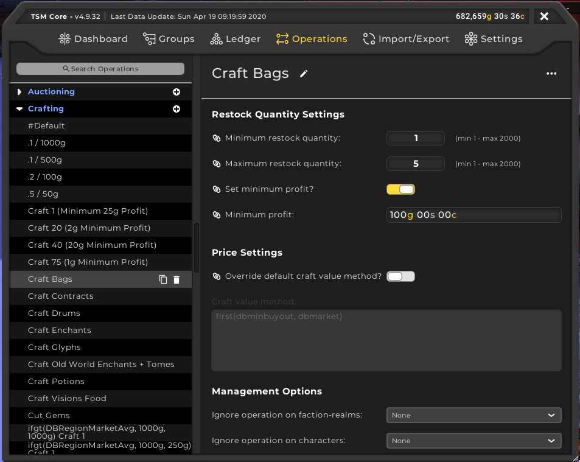
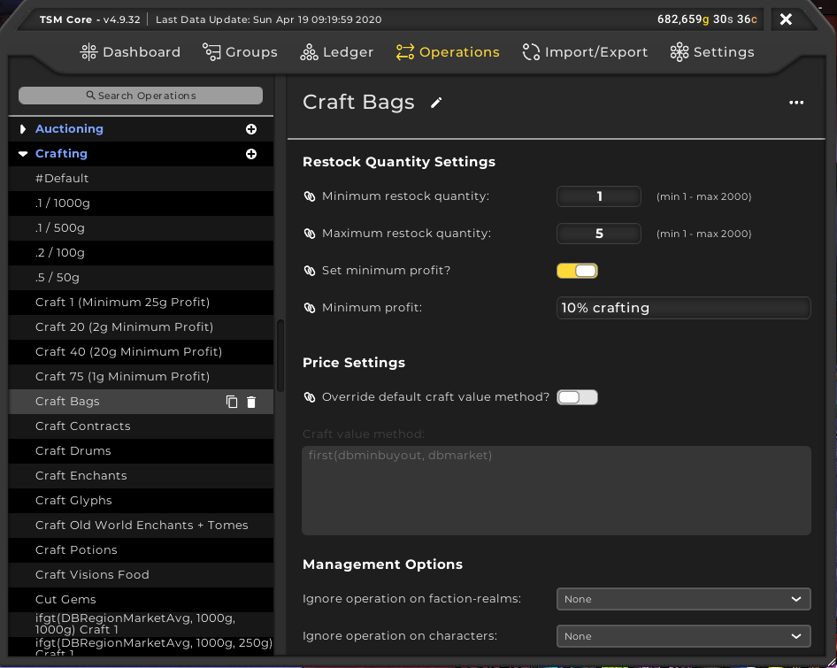
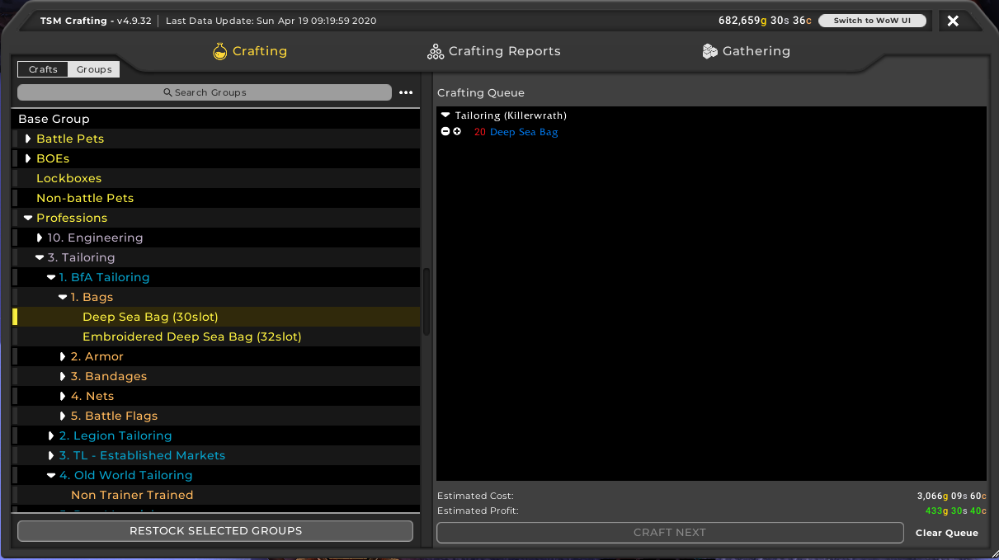
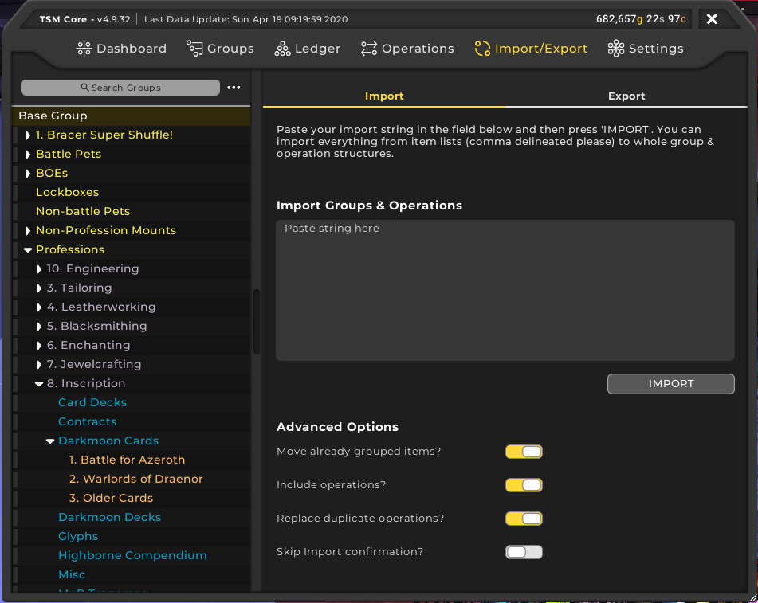

So, you want to start using TradeSkillMaster to make gold. TSM is a fantastic addon for assisting players in making gold. Such features include the ability to post mass auctions with a few clicks on the mouse and even helping users to craft items that are profitable. In this beginners guide, we will go through the following:
 - [Setting up a TSM Account and the TSM App](/tsm-guide-part-1)
 - [TSM Introduction and TSM Groups](/tsm-guide-part-2)
 - [TSM Operations and posting our first auctions](/tsm-guide-part-3)
 - [Crafting items with TSM](./tsm-guide-part-4)
 - TSM Custom Prices
 - TSM Mailing Operations
 - Warehousing Operations
 - TSM Sniper

In this part, we're going to go over crafting items in TSM and how we can use TSM to not only find out what items are worth crafting but how to automate the process of crating those items. We're going to start with familiarising ourselves with the TSM Crafting window. If you click on a profession button and the TSM Crafting window doesn't appear straight away, simply click on the TSM4 button near the X button in the top right corner and the TSM Crafting window should replace the standard WoW crafting window.

So, you can see a crafting queue on the right hand side of the window. This is incredibly useful because you can queue up items and craft them as you go without having to remember which items you wanted to craft. You can click on an item and then click on Queue and it goes into the Crafting Queue. 

Now that we're familiar with the TSM Crafting window, it's time for us to dive into Crafting operations. We will use a the same method of creating methods like we did with creating the Auctioning operator in the last part but this time, we're using the Crafting Section and you should see something like this when you're done.

I'm going to use this operation for crafting [Deep Sea Bags](https://www.wowhead.com/item=154695). Now I want to have 20 of them at any one time so we're going to set the maximum restock quantity to 20. I will use a minimum profit but I want at least 10% of the crafting cost we will set that like below.

We can now go back to the crafting window and make use of the Groups tab on the left hand side of the window. Select the group with the crafting operation and click Restock Selected Groups to add items automatically to the Crafting Queue like below.

At this point, I should point out that there are pre-made groups that other goldmakers have created. I mentioned in the [Recommended Addons](/recommended-addons) guide that I use both [Sheyrah](https://pastebin.com/u/Sheyrah) and [Torack](https://pastebin.com/u/Torack) which imports profession groups. To import these groups within WoW, after copying the group you want, you open the main TSM window and click on Import/Export. Paste the contents in the text area provided and click on Import. 

This will take a bit to process particularly for the larger groups. You will be sent to another window asking if you want to import the groups/operations. Click Confirm and then you have imported groups and some will have operations already attached.

That wraps up this particular part of the TSM guide. We will be revising the TSM Crafting window in the next part as we will be going over Custom Prices and how we can add custom prices to items like [Blood of Sargeras](https://www.wowhead.com/item=124124/) and [Expulsom](https://www.wowhead.com/item=152668/).