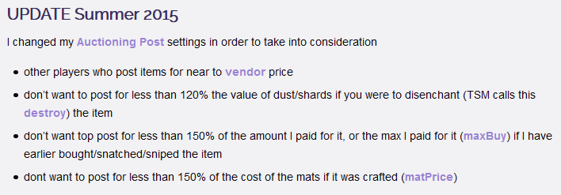
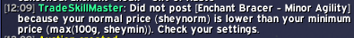
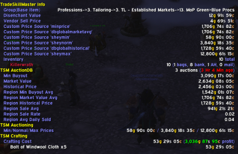
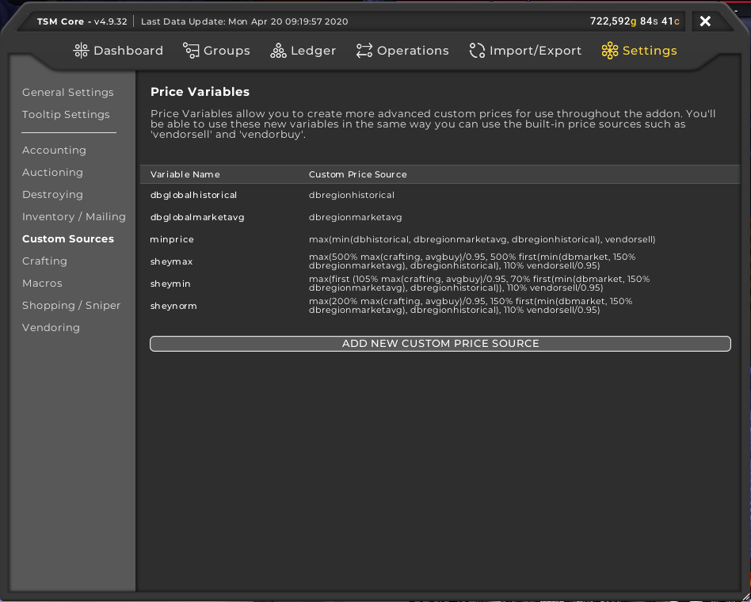
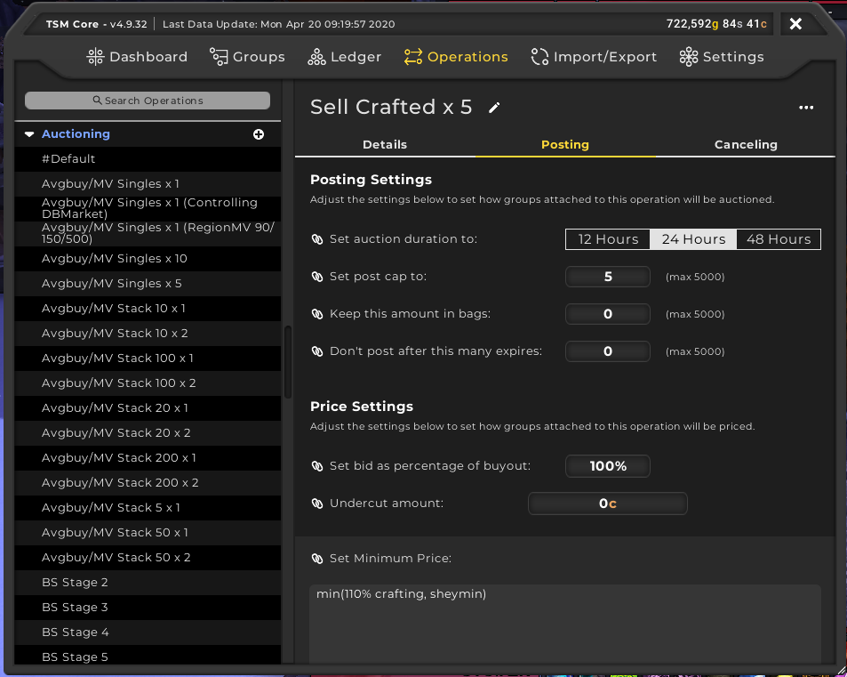
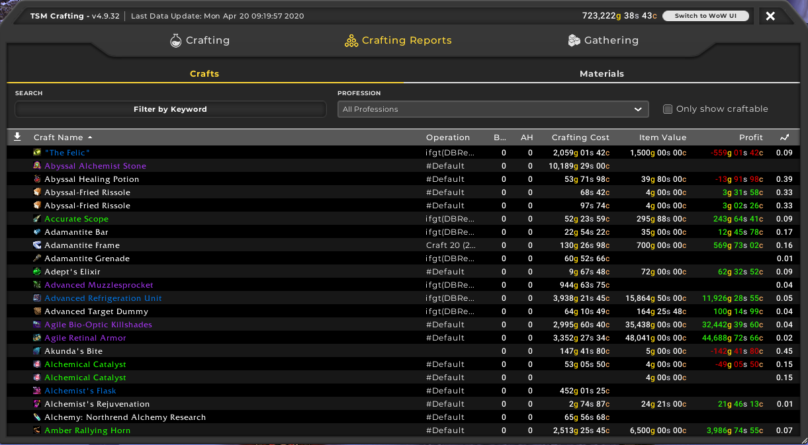
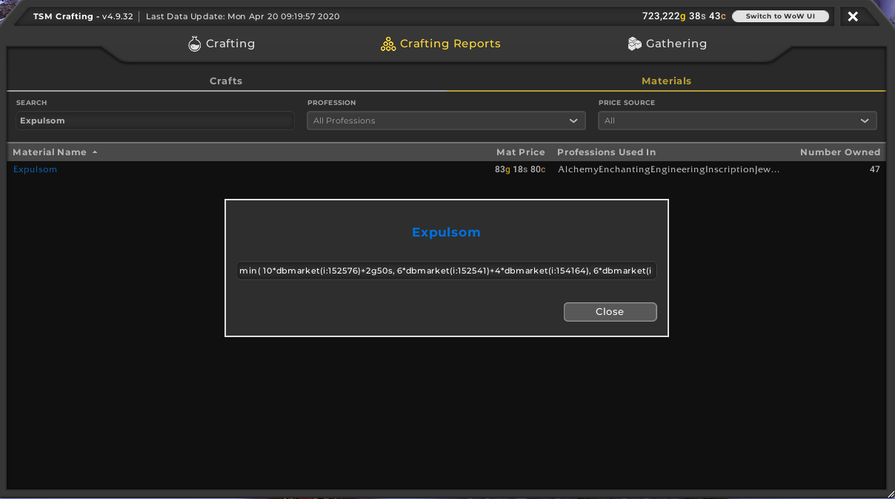

So, you want to start using TradeSkillMaster to make gold. TSM is a fantastic addon for assisting players in making gold. Such features include the ability to post mass auctions with a few clicks on the mouse and even helping users to craft items that are profitable. In this beginners guide, we will go through the following:
 - [Setting up a TSM Account and the TSM App](/tsm-guide-part-1)
 - [TSM Introduction and TSM Groups](/tsm-guide-part-2)
 - [TSM Operations and posting our first auctions](/tsm-guide-part-3)
 - [Crafting items with TSM](./tsm-guide-part-4)
 - [TSM Custom Prices](./tsm-guide-part-5)
 - TSM Mailing Operations
 - Warehousing Operations
 - TSM Sniper

In this section, we're going to cover custom prices and how writing some equations using TSM's price sources ([here](http://support.tradeskillmaster.com/display/KB/Custom+Prices) for a reminder) can help us dynamically set prices. We will also be setting some custom prices for particular materials that are soulbound and thus can't be prices normally as they can't be sold on the Auction House such as [Blood of Sargeras](https://www.wowhead.com/item=124124/) and [Expulsom](https://www.wowhead.com/item=152668/).

Now, we're going to revisit The Gold Queen's [article](http://www.thegoldqueen.com/warcraft-addons/vendor-disenchant-greens-part-2/) that we used back in part 3 of this guide. There was an update that I mentioned that we should not worry about for the moment because we were going to cover it in a later part. Well, this is that very part. We're going to go over that update to start us off. 

**Note: DBGlobalMarketAvg and DBGlobalSaleAvg were discontinued with TSM 4. Instead we use DBRegionMarketAvg and DBRegionSaleAvg instead**

To start with, we're going to dig into what considerations The Gold Queen wanted to consider and how this can be achieved using price sources.

To achieve this, most of the work is actually in the minimum price as this will determine whether we need to disenchant or vendor the item.
So, we're going to use the Regional Sale Avg, vendor sale price, destroy value, maximum buy value and the crafting material cost. The price string will look something like this

`max(90% DBRegionSaleAvg, 130% vendorsell, 120% Destroy, 150% maxBuy, 150% matPrice)`

Here we're getting the maximum value of all of these sources. If a item does not fall under any of these , then you will get an error as you try to post that item, similar to this

This error is actually really good because now you can take a look at the Disenchant and Vendor Sale values in the tooltip like with this item

Notice at the very top of the tooltip, you can see the Disenchant value and the Vendor Sell price. If you can an error like above, chances are, one of those values is higher than the minimum price. At that point, if the Vendor Sale price is highest, then sell at a vendor otherwise if the Disenchant value is higher, then send that item to an enchanter toon to disenchant.

Now for the maximum and normal price strings.

Maximum Price: `max(150% ( (DBRegionMarketAvg + DBRegionHistorical) / 2), 1000% VendorSell )`\
Normal Price: `130% DBRegionSaleAvg`

For the maximum price, we're getting the combined value of the Regional Market Average and the Regional Historical Value and multiplying that by 150%. We then compare it to the vendor sell price multiplied by 1000. We want the maximum price to be quite high because it allows for a lot more wiggle room.

Now you are a bit more versed in price sources so you can create your own price strings for various groups of items. However, I don't actually use those values myself. I cheated and used a custom price source which we will get into now. I used Sheyrah's custom price sources which you can find from her [Pastebin](https://www.pastebin.com/u/Sheyrah). If you have imported any of her groups, these custom price sources should have been imported by default so you can use sheymin, sheymax and sheynorm straight away. Otherwise, let's get started on creating those custom prices. 

Start by opening up the main TSM window. Click on Settings and then on Custom Sources. Now, I already have these values filled in but all you need to do is copy the value from Sheyrah's Pastebin, then click on Add New Custom Price Source. Enter in the name of the source, and then the price string. Hit Enter and then your done!

For some of my Auctioning operations that involve crafted items, I have made a slight alteration. I modified the minimum price so it would get the minimum value between 110% of the crafting cost and sheymin as you can see below. This allows me to only list items that give me a profit of 10% of the crafting cost ([Remember my crafting operation?](/tsm-guide-part-4)).

Now, in the last section, you would have noticed certain items that didn't show a profit next to their name. When you hover over, you realised that certain materials had no associated cost like [Expulsom](https://www.wowhead.com/item=152668/). Now expulsom is used in quite a few crafts in Battle for Azeroth so we want to know if these crafts are profitable. Luckily we have a way to fix that. 

In Battle for Azeroth, you can obtain expulsom by scrapping items at the scrapper. But considering we're doing this for crafting, we want an efficient method of obtaining expulsom so a lot of crafters resort to crafting cheap bracers through either Tailoring or Leatherworking. Specifically, [Tidespray Linen Bracers](https://www.wowhead.com/item=154692) for tailors, [Coarse Leather Armguards](https://www.wowhead.com/spell=256756) and [Shimmerscale Armguards](https://www.wowhead.com/spell=256757/shimmerscale-armguards) for leatherworkers. 

Now we can actually convert the cost of crafting these bracers into a price string for expulsom. I've taken this string from [The Lazy Goldmaker](https://thelazygoldmaker.com/bfa-goldmaking-making-gold-with-tailoring-in-8-3)

`min( 10*dbmarket(i:152576)+2g50s, 6*dbmarket(i:152541)+4*dbmarket(i:154164), 6*dbmarket(i:153050)+4*dbmarket(i:154164)) /0.15`

Now to explain what is going on here:\
`10*dbmarket(i:152576)+2g50s` is the cost of [Tidespray Linen Bracers](https://www.wowhead.com/item=154692).\
`6*dbmarket(i:152541)+4*dbmarket(i:154164)` is the cost of [Coarse Leather Armguards](https://www.wowhead.com/spell=256756).\
`6*dbmarket(i:153050)+4*dbmarket(i:154164)` is the cost of [Shimmerscale Armguards](https://www.wowhead.com/spell=256757/shimmerscale-armguards).

Finally, that cost is divided by 0.15 because there is an approximate 15% chance that a scrapped pair of bracers will give us expulsom.

Ok, now we have that price, we need to tell TSM that price so we open up any TSM crafting window. At the very top of the window, there are three buttons, Crafting, Crafting Reports and Gathering. We're already familiar with Crafting and Gathering but now we dive into Crafting Reports. 

Our focus is actually on the Materials side so click on that tab. In the search bar, search for Expulsom. You can now click on the Expulsom entry and see a price string entry window. Enter in the price string from earlier and then hit enter and close the window. You should now see the Mat Price now has a value. 

Now if you hover over any craft with expulsom, you can now see expulsom has a cost and now the full craft cost of that item is now visible.