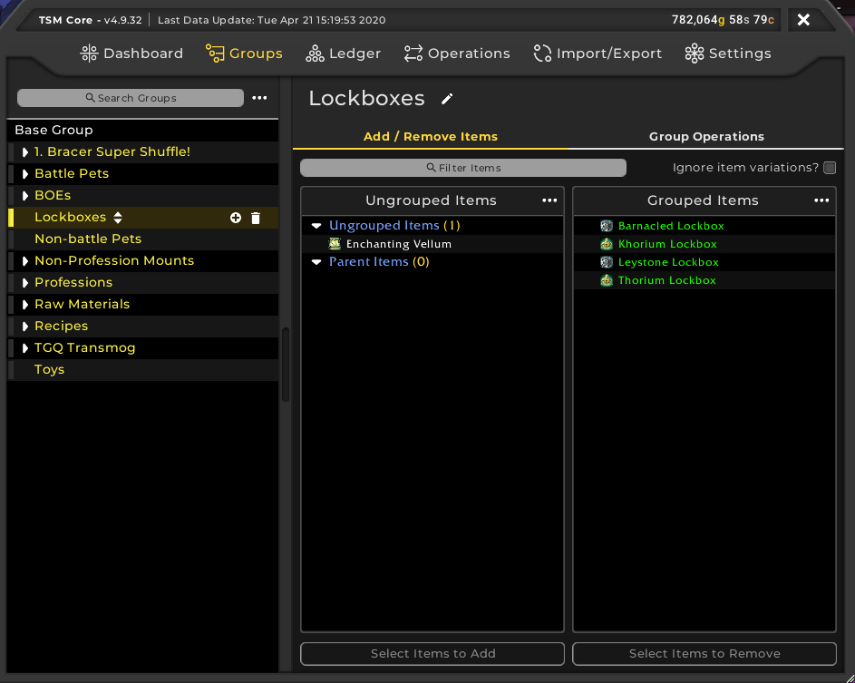

So, you want to start using TradeSkillMaster to make gold. TSM is a fantastic addon for assisting players in making gold. Such features include the ability to post mass auctions with a few clicks on the mouse and even helping users to craft items that are profitable. In this beginners guide, we will go through the following:
 - [Setting up a TSM Account and the TSM App](/tsm-guide-part-1)
 - [TSM Introduction and TSM Groups](/tsm-guide-part-2)
 - [TSM Operations and posting our first auctions](/tsm-guide-part-3)
 - [Crafting items with TSM](./tsm-guide-part-4)
 - [TSM Custom Prices](./tsm-guide-part-5)
 - [TSM Mailing Operations](./tsm-guide-part-6)
 - Warehousing Operations
 - TSM Sniper

Mailing operations are a key part of the goldmaker's toolkit as they can automate the process of sending certain items to a particular toon. For instance, it's much easier to all lockboxes to a rogue toon as rogues have the lockpicking skill. So in this part of the TSM guide, we're going to cover how to make a mailing operation using Lockboxes as an example.

As we've done before, head on over to Group Operations and under Mailing, use the dropbox to select Create New Operation. First, we will need a Target Character to mail these lockboxes to, luckily I already have this operation setup for my rogue. 

Now you can decide to keep a certain amount of items. By default, this value is 0 which means it will send all items in that group to the Target Character. 

You can also set a maximum amount to send, i.e. you only want to send a certain amount of [Ghost Iron Bars](https://www.wowhead.com/item=72096) to a engineer and a blacksmith to craft Pandaria cooldown crafts such as [Jard's Perculiar Energy Source](https://www.wowhead.com/item=94113/), [Balanced Trillium Ingot](https://www.wowhead.com/item=98717/) or [Lightning Steel Ingot](https://www.wowhead.com/item=94111/).

Four our purposes, we don't want to keep any lockboxes and we won't be setting a maximum. We want them all gone so our rogue toon can unlock them. Now with other TSM operations, you can stack them. So if you are creating one for sending ghost iron for instance, you can have your engineer first and then your blacksmith second and TSM will prioritise sending the ghost iron to your engineer first. A personal recommendation is to first create a mailing operation for each alt you have and then create a few quantity limited operations specific for sending certain items. 

Now let's mail those lockboxes. Now if you go to your mailbox and the TSM Mailing window doesn't appear straight away, click on the TSM4 button on the top left hand corner of the window. From there, click on the Groups tab, select your group and click Mail Selected Groups.

Within a few moments, all of your lockboxes will be sent over to your rogue character. All you need to do now is log over, collect them from the mail and start lockpicking.